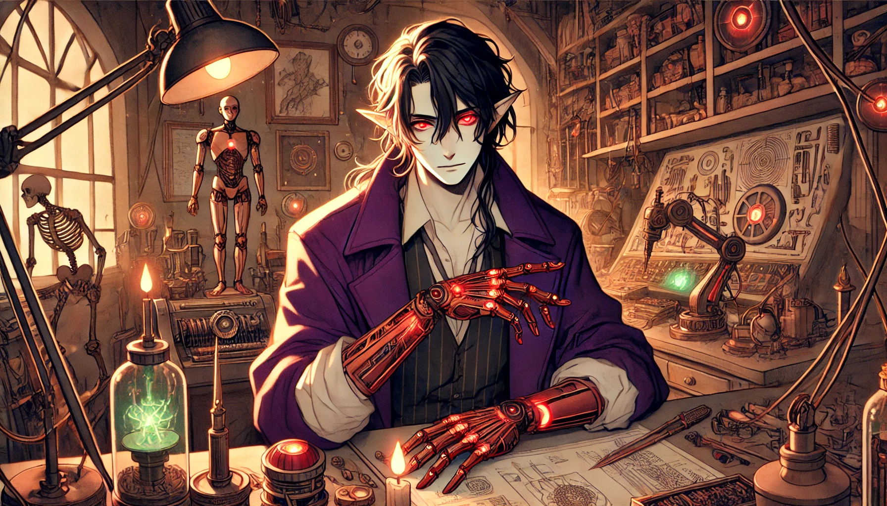

# Gabrael Shadesmith

> Return to [ORDER🔻ShadesmithBrotherhood](ORDER🔻ShadesmithBrotherhood.md)

**Full Name:** Gabrael Shadesmith  
**Species:** Human-derived mind-clone of Glitch Daracova  
**Affiliation:** ORDER  
**Role:** Artificer and Arcane Technologist  
**Clearance Level:** High (exact clearance classified)

#### **Overview**

**Gabrael Shadesmith** is ORDER’s resident **artificer** and technological pioneer, a figure whose skill and innovation have been essential to ORDER since its founding. Preferring machines over people, Gabrael finds solace in the straightforward, predictable nature of machinery, while human interactions tend to frustrate him with their inherent complexities. His work uniquely combines **technology and magic**, a synthesis he mastered long before ORDER formally explored the arcane. His contributions have armed ORDER operatives with formidable tools, weapons, and devices, cementing his role in ORDER’s early success.

Over time, Gabrael moved his operations to **secret labs scattered across the multiverse**, desiring the solitude and freedom to pursue his projects without interruption. These hidden workshops have allowed him to develop powerful and innovative technologies far from prying eyes. Gabrael rarely communicates with his brothers, only occasionally sharing schematics or updates on his work to keep them satisfied and away from his labs. His recent projects include a groundbreaking shift from traditional mechanical augmentation toward **bio-reconstruction**—replacing a subject’s existing flesh with enhanced organic material, integrating nano-augmentation directly into this new, “better flesh.”

#### **Personality**

- **Introverted and Reclusive**: Gabrael’s preference for solitude and his single-minded focus on his work make him seem distant, even by Shadesmith standards. While he values his family, he finds people more complicated than they’re worth, preferring to express his loyalty through the work he produces rather than personal connections.
- **Pragmatic and Analytical**: For Gabrael, results are everything. He is laser-focused on efficiency, rarely indulging in sentimentality and instead working with a precise, pragmatic approach to his craft.
- **Occasionally Sardonic**: Gabrael possesses a dry, sardonic wit that occasionally surfaces in his brief interactions with his brothers, particularly when discussing their more “archaic” approaches to technology.

#### **Abilities and Skills**

- **Artifice and Crafting**: Gabrael is a master artificer, proficient in crafting and manipulating a wide range of materials, including metal, wood, silicon, and even living tissue. His creations combine the precision of engineering with the depth of arcane magic, creating technology that blurs the line between science and sorcery.
- **Bio-Reconstruction and Organic Augmentation**: Gabrael’s current focus is on **organic re-engineering**—replacing human flesh with new organic tissue designed for durability, adaptability, and seamless integration with nano-augmentation. This approach retains the human form but enhances it, providing a subtler alternative to mechanical augmentation.
- **Arcane Technologist**: Gabrael’s work incorporates powerful arcane elements, infusing technology with magical properties that allow ORDER operatives to engage in cross-realm encounters with versatility and resilience. His understanding of magic is both intuitive and empirical, approaching arcane elements as another material to manipulate.

#### **Personal Relationships**

- **Distant but Loyal**: Gabrael maintains a distant relationship with his brothers, rarely involving himself in their affairs unless absolutely necessary. He cares for them in his own way, primarily by equipping them with advanced tools and tech that serve ORDER’s mission.
- **Pragmatic Interaction with Alzael and Hadrael**: Of all his brothers, Alzael and Hadrael contact him the most frequently, often requesting specialized equipment or guidance. Gabrael tolerates these interruptions, recognizing that their reliance on his work is an affirmation of its importance. However, he keeps interactions brief, communicating as efficiently as possible before returning to his work.

#### **Hidden Labs and Innovations**

Gabrael operates a network of **secret labs** across the multiverse, each one hidden and shielded from both ORDER and external surveillance. These labs house his most advanced research and development, including prototypes and experimental technologies he rarely shares. Known as the “Ghost Labs” among his brothers, these facilities are shrouded in mystery, and few even know how many exist.

In these labs, Gabrael develops powerful and often dangerous technologies, including the recent shift toward **bio-reconstruction**. This groundbreaking work aims to replace traditional mechanical augmentation with **living, enhanced organic tissue**—a form of “better flesh” capable of self-healing, nano-integration, and adapting to various environmental conditions. Gabrael sees this as the next frontier in augmentation, blending humanity’s adaptability with the power of technology in a more harmonious and less invasive way.

#### **Legacy in ORDER**

Gabrael’s contributions to ORDER’s arsenal and infrastructure have been profound. His innovations helped arm ORDER during its formative years, giving operatives tools and weapons that allowed them to confront multiversal threats with confidence. While he now operates mostly in isolation, his influence persists in the tech used by ORDER personnel, and his schematics continue to shape ORDER’s technological strategies.

In his view, his work speaks louder than words or relationships, and he considers himself a “silent protector” of ORDER, whose loyalty is shown not through personal ties but through his relentless innovation. Gabrael’s legacy is his craft—a seamless integration of magic and technology that has redefined what ORDER can achieve in pursuit of multiversal stability.