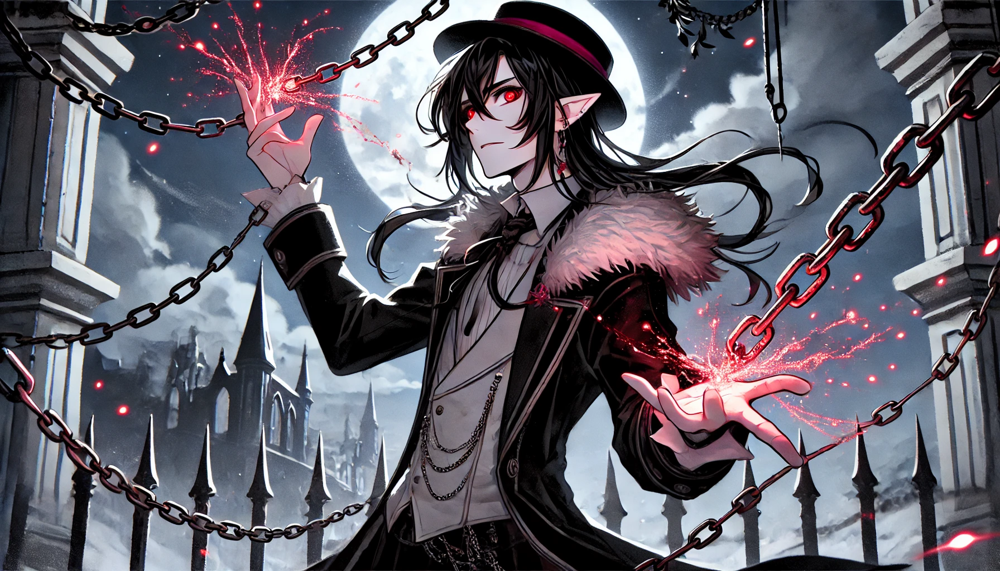

# Hadrael Shadesmith

> Return to [ORDER🔻ShadesmithBrotherhood](ORDER🔻ShadesmithBrotherhood.md)

> Reccomended Reading: [ORDER🔻AlzaelShadesmith](ORDER🔻AlzaelShadesmith.md)

**Full Name:** Hadrael Shadesmith  
**Species:** Human-derived mind-clone of Glitch Daracova  
**Affiliation:** ORDER  
**Role:** Rogue, Thief, and High-Level Operative  
**Clearance Level:** High (exact clearance classified)

#### **Overview**

Hadrael Shadesmith is the **rogue** of the Shadesmith Brotherhood, known for his **reckless charm, dark humor, and thrill-seeking nature**. He serves ORDER with an approach that combines tactical skill with opportunism, making him effective in both combat and high-stakes negotiations. Though he often clashes with his brothers, Hadrael is particularly close to Alzael, with whom he shares a unique friendship defined by both rivalry and mutual respect. Cursed and unable to fly like his siblings, Hadrael instead uses **ethereal chains as grappling hooks** to maneuver. Despite his chaotic personal life, Hadrael was forever changed by the arrival of his daughter, Katarina, who forced him to confront his past and rethink his future.

#### **Personality**

- **Rebellious and Impulsive**: Hadrael is willing to break rules if he believes it will get results, showing little patience for strict protocols.
- **Dark Humor and Sarcasm**: Known for his biting wit and occasionally offensive jokes, he often uses humor to deflect tension or disarm opponents.
- **Loyal but Complicated**: Hadrael has a deep sense of loyalty to ORDER and his brothers, though he often walks a fine line between obedience and rebellion.

#### **Abilities and Skills**

- **Stealth and Infiltration**: Hadrael’s experience as a thief makes him an expert in covert entry, evasion, and reconnaissance.
- **Close-Combat and Grappling**: Due to his curse, Hadrael cannot fly or pilot aircraft but uses **ethereal chains** as grappling hooks to scale obstacles and perform high-mobility combat maneuvers.
- **Charisma and Manipulation**: Hadrael can be charming when he wants, often persuading others through wit and a roguish charm, which makes him effective in both negotiations and espionage.

#### **Personal Relationships**

- **Alzael Shadesmith**: Alzael’s opposite and best friend, Hadrael often sparring with him (both verbally and physically). Their rivalry is balanced by mutual respect and a shared belief in ORDER’s mission.
- **Katarina**: One of Hadrael’s many children, Katarina sought him out, challenging him to be more than a rogue and forcing him to consider his legacy. Her influence has made Hadrael more introspective and self-aware.

#### **Combat Bot**

- **Name**: Known to his brothers as “Blackthorn.”
- **Appearance**: Black with red accents, reflecting Hadrael’s aggressive style and familial heritage.
- **Abilities**: Equipped with miniature ethereal chains for grappling, cloaking technology, and high-speed offensive maneuvers, representing Hadrael’s unpredictable, confrontational style.
---

*notes, to be cleaned up,  integrated with the above, and eventually removed*

### Alzael and Hadrael Shadesmith: Rivals, Allies, and Brothers

The dynamic between **Alzael** and **Hadrael Shadesmith** is one of ORDER’s most complex and captivating partnerships. **Alzael** embodies honor, diplomacy, and restraint, while **Hadrael** represents roguish charm, impulsive violence, and dark humor. Despite their many differences—or perhaps because of them—they are best friends and closest allies, complementing each other’s strengths and balancing each other’s weaknesses.

#### **Hadrael Shadesmith: The Rogue with a Dark Edge**

**Hadrael Shadesmith** is the rebel of the Shadesmith Brotherhood, known for his skills as a **thief, gambler, and master of underhanded tactics**. His humor is dark and often shocking, contrasting sharply with Alzael’s refined wit. Though he shares Alzael’s belief that diplomacy should be the first approach, he’s quick to turn to violence when he senses that words will no longer suffice. In these moments, Hadrael becomes a highly effective and ruthless enforcer, seeing his role within ORDER as one that sometimes requires going to unsavory lengths to get results.

Hadrael’s **approach to life is equally impulsive** and irreverent; he’s known for his chauvinistic tendencies and an endless string of romantic entanglements, often with little regard for consequences. A man of contradictions, he is both the brother Alzael trusts most and the one who frustrates him endlessly. Together, they spar verbally and physically, their friendly ambush-style “greetings” often startling everyone around them.

#### **Hadrael’s Curse: Grounded Wings**

Unlike the rest of the Shadesmith brothers, Hadrael is cursed with the inability to fly. **He cannot manifest wings**, an affliction he bears with a mix of resentment and humor, often playing up his “grounded” nature as part of his rogue persona. Instead of wings, Hadrael has manifested **ethereal chains**, which he uses as grappling hooks to move deftly through difficult terrain, urban landscapes, and high-security areas. While this curse has prevented him from ever piloting aircraft or spacecraft, Hadrael’s skills in driving land and sea vehicles are unmatched, and he sees his curse as just another tool in his versatile set of tricks.

#### **Rivalry and Friendship with Alzael**

Alzael and Hadrael’s rivalry runs deep, yet it’s rooted in mutual respect and the knowledge that each brings something essential to ORDER’s mission. They have an unspoken agreement that **their opposing natures make them stronger together**—Alzael’s honorable and diplomatic approach often tempering Hadrael’s impulsiveness, and Hadrael’s willingness to take risks helping Alzael to act decisively when necessary. Their frequent sparring and clashes in the field serve as a testament to their bond, a ritualized way of testing each other’s skills and maintaining their fierce loyalty to one another.

Their relationship represents a balance within ORDER itself: the tension between honor and pragmatism, patience and force, control and chaos. They view each other as **true equals**, with no hierarchy between them despite their differences in character. Hadrael’s occasional darkness is offset by Alzael’s steady influence, just as Alzael’s strict code of honor is lightened by Hadrael’s irreverence.

#### **A Changed Man: Hadrael’s Daughter, Katarina**

Hadrael’s chaotic lifestyle left him with many children across realms, most of whom he has never met. However, one of them, **Katarina**, sought him out, forcing Hadrael to confront parts of himself he’d long ignored. Her presence in his life marked a turning point, challenging him to reconcile the impulsive, often reckless man he had been with the person he aspired to be. Katarina’s arrival introduced a new dimension of accountability to Hadrael’s life, reshaping his views on responsibility and loyalty.

Katarina’s influence has made Hadrael more introspective, and while he hasn’t abandoned his roguish ways entirely, he now carries a quieter resolve, an understanding that his actions leave ripples far beyond his own life. This personal evolution has deepened his bond with Alzael, as both now share a commitment not only to ORDER’s mission but to the possibility of redemption, legacy, and personal growth.

#### **Brothers Bound by Contrasts**

Together, Alzael and Hadrael represent two sides of a powerful whole within ORDER: the **light of honor and the shadow of pragmatism**. Their friendship, rivalry, and loyalty to each other define their unique place within the Shadesmith Brotherhood and within ORDER itself. They are brothers, opposites, and allies, each pushing the other to new heights and reminding one another of what it means to serve a cause greater than themselves.

In Hadrael, ORDER finds a rogue willing to cross boundaries in pursuit of security, and in Alzael, a diplomat who values stability above all. Their balance of restraint and recklessness is one of ORDER’s most valuable assets, a partnership forged in mutual respect and tempered by their willingness to embrace both light and dark. Together, they protect ORDER’s vision, embodying both the loyalty and complexity that define the Shadesmith Brotherhood.