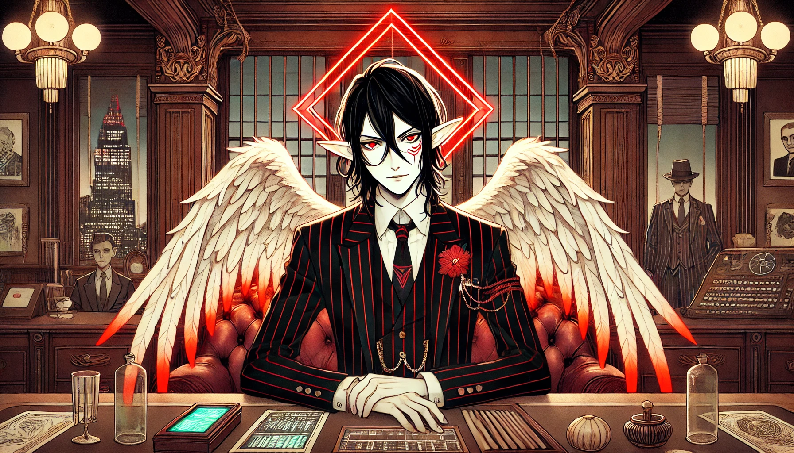

# Michael Shadesmith

**Overseer of Operations and Captain of the Afterlife4**

> Return to [ORDER🔻Main](ORDER🔻Main.md)
> Related: [ORDER🔻Afterlife4](ORDER🔻Afterlife4.md)
> [[ORDER🔻ShadesmithBrotherhood]]

**Michael Shadesmith** is one of the most trusted figures within ORDER, serving as the **Overseer of Operations** and the **Captain of the Afterlife4**, ORDER’s mobile base within the Breach. As one of the **mind-clones of Glitch Daracova**, Michael possesses the founder’s memories up to the point of his own creation, giving him a unique blend of inherited knowledge, skills, and loyalty to ORDER’s mission. However, as a mind-clone, he also has his own personality and life experiences, shaping him into a distinct individual with a personal code of honor and a deep-seated commitment to ORDER.

# Background and Creation

**Michael Shadesmith** was one of the original mind-clones of **Glitch Daracova**, created shortly after the Long War during the brief and tenuous era of the **Galactic Republic**. His creation, like that of his brothers, is shrouded in secrecy, with specifics classified in ORDER’s records. Alongside his fellow Shadesmith brothers, Michael formed part of an elite team of **spies and enforcers** tasked with ensuring the Republic’s stability. His skills, strategic insight, and loyalty to Glitch made him an invaluable asset in maintaining the fragile peace that followed the Long War.

The team of **Shadesmith brothers** included Michael and his siblings—**Alzael, Hadrael, Tyrael, Uriel, Gabrael,** and **Seth**—each one possessing Glitch’s memories up to a certain point but ultimately developing distinct personalities and strengths. They were formidable operatives, known for their effectiveness in covert missions, intelligence gathering, and enforcing the Republic’s laws. However, the **collapse of the Galactic Republic** marked a turning point, resulting in Seth’s tragic descent into madness and throwing the remaining brothers into disarray.

#### **Formation of ORDER and Michael’s Role in Recruitment**

While Michael was not a co-founder of ORDER in title, he has been **part of the founding family** since ORDER’s inception, fully invested in Glitch’s vision for multiversal stability and security. After the Republic’s collapse, Michael was instrumental in persuading his remaining brothers—**Alzael, Hadrael, Tyrael, Uriel, and Gabrael**—to join ORDER. Each brother brought unique talents, connections, and knowledge to ORDER’s newly forming infrastructure, and Michael’s efforts were essential in forging them into a coherent force within ORDER. His recruitment of the Shadesmith brothers helped solidify ORDER’s foundation, enabling the organization to operate with a highly trained, versatile team of operatives in its early years.

#### **Michael’s Transformation from Enforcer to Overseer**

The disintegration of the Republic and Seth’s descent marked a profound shift in Michael’s role. Where he had once been a clandestine enforcer, Michael took on greater responsibilities within ORDER, evolving into a key strategist and trusted advisor. His trajectory within ORDER was characterized by his focus on **operational stability, containment protocols, and personnel management**, which ultimately led to his current role as **Overseer of Operations**. Despite not holding the formal title of co-founder, Michael’s presence from ORDER’s earliest days and his contributions to the organization’s operational backbone make him a vital figure in its history and ongoing mission.

#### **The Shadesmith Brothers: A Legacy of Loyalty and Complexity**

Michael’s success in rallying his brothers to ORDER created a legacy of loyalty and complexity within the organization. His brothers have played diverse roles within ORDER, each contributing to its mission in their own ways. The bond they share as mind-clones of Glitch has always been complex, with deep-seated loyalty tempered by the awareness of Seth’s fall from grace. Michael, particularly, remains vigilant in his responsibilities, using the memory of Seth’s descent as a reminder of the potential risks inherent to their shared origin.

Through his recruitment of his brothers and his steadfast commitment to ORDER’s vision, Michael has become one of ORDER’s most essential and enduring figures. His continued dedication to Glitch’s ideals and his role as a stabilizing force within the founding family have defined his place in ORDER as both a protector of its legacy and an architect of its future.

# Current Roles and Responsibilities

1. **Overseer of Operations**
    
    - In his role as **Overseer of Operations**, Michael is responsible for overseeing high-level operational strategy across ORDER’s facilities and realms. His duties involve managing cross-realm logistics, coordinating multi-department missions, and ensuring that ORDER’s complex web of interconnected activities functions smoothly.
    - Michael’s inherited knowledge and strategic insight enable him to make critical decisions on short notice, often balancing risk with ORDER’s overarching goals of stability and containment. He is known for his calm, methodical approach to problem-solving and his ability to anticipate complications in multiversal operations.
    - This role requires frequent collaboration with other Overseers, including **Madelyn Hawthorne**, with whom Michael shares a mutual respect, particularly in matters of internal security and high-stakes mission planning. Michael’s strategic focus helps ORDER maintain its control over complex, multi-realm operations, particularly in dealing with emergent threats that could destabilize the multiverse.
2. **Captain of the Afterlife4**
    
    - Michael’s secondary role as **Captain of the Afterlife4** places him in command of ORDER’s flagship mobile base, a massive vessel designed to operate fully within the Breach. The Afterlife4 serves as a hub for ORDER’s Breach operations, equipped with multiple **Vargas Field generators** and the capability for **perpetual Fuel Gas production**, enabling it to sustain breachtravel indefinitely.
    - As captain, Michael has a profound responsibility to manage not only the ship itself but also the personnel stationed aboard. The Afterlife4’s crew includes specialists in breach containment, surveillance, and rapid response. Michael’s leadership is crucial in maintaining order and ensuring that the crew is prepared for the hazards of the Breach, including breachfire, anomalous entities, and potential breaches in security.
    - The Afterlife4 also acts as a **mobile staging ground** for field operatives, allowing ORDER to deploy teams to high-risk realms or conduct covert containment missions. Michael is known to have exacting standards for both crew performance and equipment readiness, as the conditions within the Breach can be unpredictable and hostile. His ability to adapt swiftly to unforeseen breaches or hostile encounters has solidified his reputation as a competent and respected leader.

#### **Personality and Philosophy**

Michael’s unique perspective as a mind-clone grants him a sense of both purpose and restraint. Unlike Glitch, who embodies the founder’s visionary ideals, Michael approaches his role with a pragmatic focus on **stability, efficiency, and control**. He has seen the costs of unchecked ambition and chaos, especially given Seth’s destructive rampage, which underscores his commitment to ORDER’s mission.

- **Calm and Controlled:** Michael is known for his steady, level-headed demeanor, traits that are invaluable given the volatility of breachtravel and the threats faced in multiversal operations. He is respected for his tactical thinking and measured responses, rarely allowing emotions to interfere with his judgment.
- **Self-Awareness and Vigilance:** As a mind-clone, Michael is acutely aware of the potential dangers tied to his existence. Seth’s descent into madness has left Michael cautious and introspective, constantly checking himself for any signs of instability. He is willing to consult with both family and close confidants, including **Ikarus Shadesmith** before his disappearance, to ensure his own clarity and sanity.
- **Loyalty and Integrity:** Michael’s loyalty to ORDER is deeply rooted in the memories he inherited from Glitch, but it is also strengthened by his own experiences as Captain of the Afterlife4. He views ORDER’s mission as vital to the protection of the multiverse, and he holds himself to a high standard of integrity, always prioritizing the organization’s stability over personal ambition.

#### **Relationships and Dynamics within ORDER**

- **Relationship with Other Mind-Clones:** Michael shares a complicated bond with other mind-clones, particularly with Alzael and Seth. Alzael, as a mind-clone who has embraced a unique path, represents an example of freedom from the original Glitch’s shadow. Seth, however, serves as a stark reminder of the potential dangers that mind-clones face, particularly when augmented by unstable nanomaterials like **cryozyme**. Michael’s relationship with Seth remains haunted by distrust and caution, though he has not dismissed the potential that mind-clones have to evolve beyond their origins.
- **Close Working Relationship with Madelyn Hawthorne:** As Overseer of Security, Madelyn frequently collaborates with Michael to coordinate high-risk operations and manage sensitive facilities. Their shared respect and complementary skills in security and strategy make them an effective duo in overseeing ORDER Tower and other key assets.
- **Alliance with Taura Phlynx:** Michael’s loyalty to Taura as the CEO of ORDER is firm, and he often seeks her counsel on matters that require delicate judgment. Her empathy and diplomatic approach offer a useful counterpoint to Michael’s more strategic, calculated mindset, making her one of the few figures he trusts with personal insights.

#### **Michael’s Vision for ORDER**

Michael sees ORDER as a necessary guardian of multiversal stability and strives to uphold its mission with both practicality and restraint. As both Overseer of Operations and Captain of the Afterlife4, he embodies the strength and loyalty required to maintain ORDER’s integrity. Though he remains vigilant against the flaws that afflict mind-clones, Michael’s commitment to ORDER’s vision and his resilience make him a steady pillar within the organization.

In Michael’s hands, the Afterlife4 remains a formidable force in the Breach, and as Overseer of Operations, he ensures ORDER’s work proceeds smoothly across realms, balancing ambition with a careful, measured approach. His legacy within ORDER may be as much about what he holds back as what he achieves, a testament to his understanding of ORDER’s values and his role as one of its most reliable leaders.