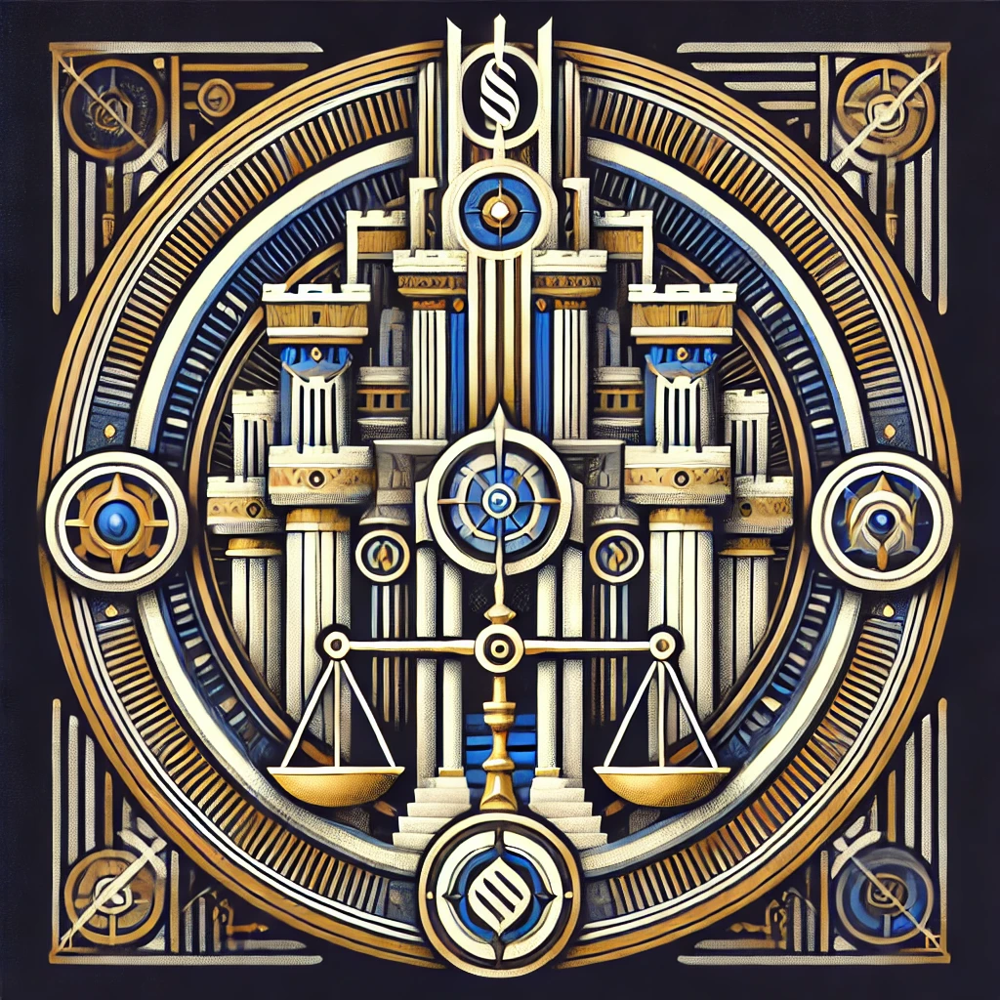

A - the [Erewhon🏛Pantheon](Erewhon🏛Pantheon.md)

---

**Dauros, God of Order and Civilization**: Dauros champions the virtues of order and civilization, promoting justice and stability in the realms of mortals. As the patron of kings and law-men, he upholds the rule of law and ensures the prosperity of cities and kingdoms.